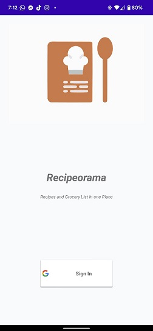
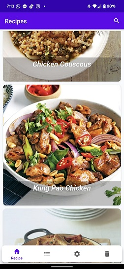
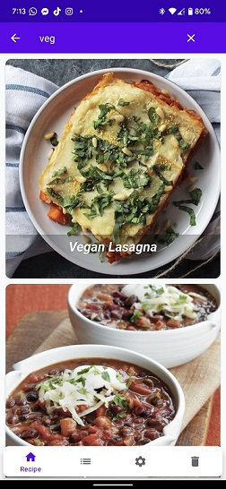
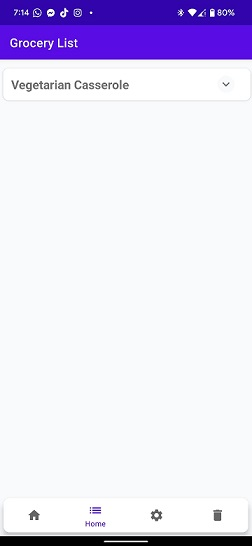
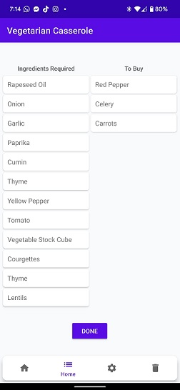
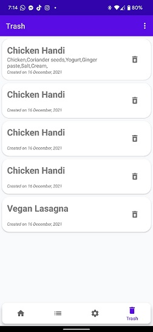

# Recipeorama
**App Name:** Recipeorama  
**Authors:** Simar Bhamra & Fahad Ansar  
**Platform:** Android  
**Programming Language:** Kotlin  
**Tools Used:** Room Database, Retrofit API, Firebase, MealsDB API  
# Overview
Recipeorama is an application where the users have the functionality to look up recipes and can add the recipe to grocery list where the user is provided with the required ingredients and the user can click on the required items to add it to buy list. The app makes use of MealsDB to fetch the recipes from the API database by also making use of retrofit and okhttp3. The grocery is saved on device via Room Database and the user is provided with functionality to backup to firebase and restore in case the application is deleted or a different device is used. The user is logged via Google Sign-in via Firebase.
## Target Audience
The application can be used by any generation since anyone can look up recipes which they want to make and add to Grocery List if any missing ingredients are required for the recipe and needs to be purchased
# APIs
The **MealsDB API** offers recipe database that is capable of returning JSON formatted data which is then accessed via **Retrofit2 API** and **Okhttp3** to integrate it into the application
# Design
UI Screens Design Explanation
* Screen 1: Allows the user to login using the Google Email ID to enter the application
* Screen 2: It provides users with the recipes and with a functionality to look up recipes they want
* Screen 3: It shows the result of a search performed 
* Screen 4: It shows the details of the recipe including the original source for the recipe and the youtube link to make the recipe
* Screen 5: It is a list of Recipe that the user desire to make and within contains the shop list for the missing ingredients
* Screen 6: It consists of all the required ingredients of the recipe and provides user with the functionality to add the missing ingredients to **To Buy** list
* Screen 7: The Recipe removed by the user will be moved to **Trash** where the user has the option to either restore it or permanently delete it
* Screen 8: It a simple screen for the user to either logout or sync their data with the firebase database  
       
# DEMO

